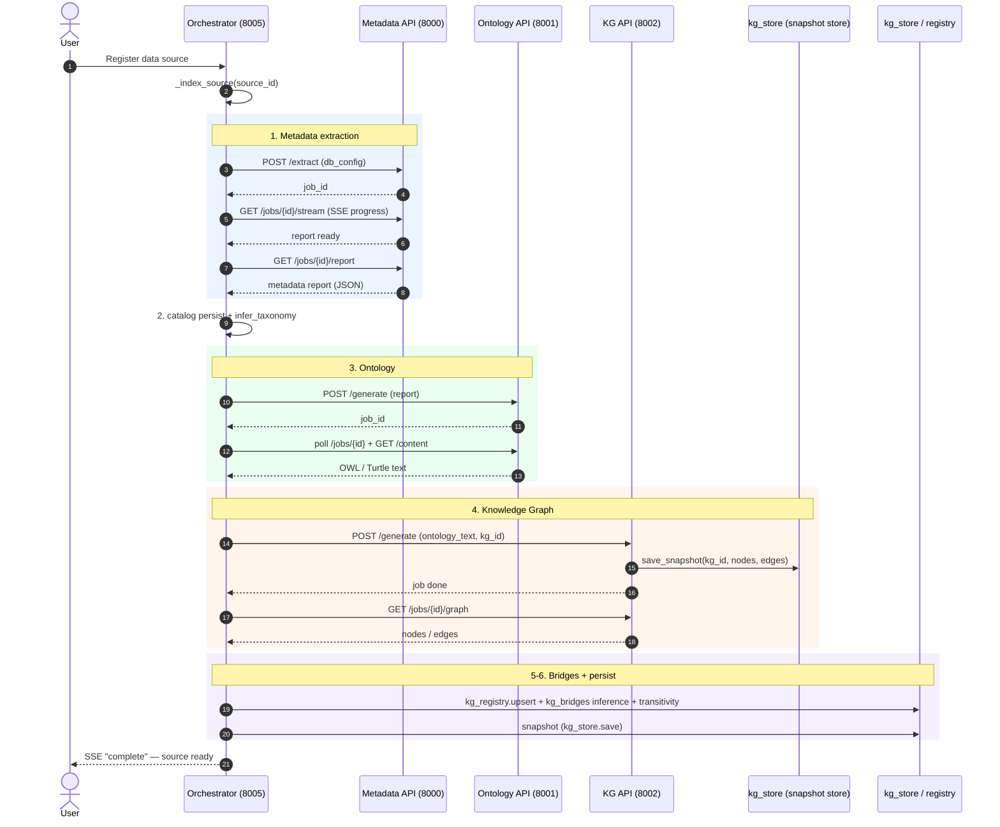
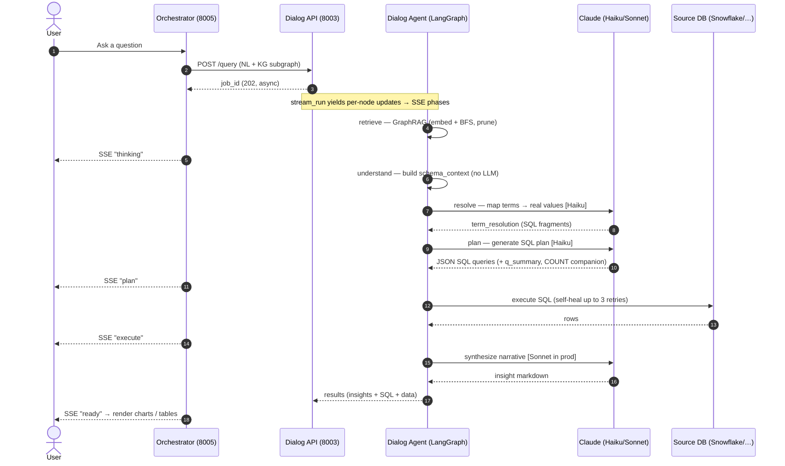

# DataNanite — How It Works (Architecture & Pipelines)

A stepwise, detailed walkthrough of how DataNanite turns a raw database into a
metadata catalog, an ontology, a knowledge graph, and a conversational analytics
experience — and how every supporting capability is built.

> **How to read this doc.** Section 1 gives the big picture and the end-to-end
> indexing sequence. Sections 2–4 detail the three core artifacts the user asked
> about (metadata → ontology → knowledge graph). Sections 5–9 cover the rest of
> the functionality (DataChat, conformity/bridges, SHACL validation, glossary,
> KPIs). Every claim is traceable to `file:line` in the repo.

---

## 1. The Big Picture

### 1.1 Architectural pattern

DataNanite is a set of **independent FastAPI microservices**, each wrapping a
**LangGraph state-machine "agent."** A LangGraph agent is a directed graph of
*nodes* (Python functions). Each node receives a shared **state dict**, does one
job, writes its outputs back into the state, and the graph routes to the next
node. This is the same shape in every service: `START → node → node → … → END`,
with a conditional branch to an `error_end` node on failure.

Every agent is **decoupled** — it consumes plain data (a dict, a string), never
another agent's Python objects. That's why the ontology agent takes a *metadata
report dict*, and the KG agent takes a *serialized ontology string*, rather than
importing each other.

### 1.2 The services and ports

| Port | Service (file) | Agent it wraps | Produces |
|------|----------------|----------------|----------|
| 8000 | agent-api (`api.py`) | Metadata Extraction (`agent.py` + `nodes/`) | Metadata report (JSON) |
| 8001 | ontology-api (`ontology_api.py`) | Ontology (`ontology_agent/`) | OWL/Turtle ontology |
| 8002 | kg-api (`kg_api.py`) | Knowledge Graph (`knowledge_graph_agent/`) | Graph nodes/edges (KG snapshot store + UI) |
| 8003 | dialog-api (`dialog_api.py`) | Dialog / DataChat (`dialog_agent/`) | NL answer + SQL + charts |
| 8004 | conformity-api (`conformity_api.py`) | Conformity / stitching (`conformity_agent/`) | Cross-KG "super graph" |
| 8005 | orchestrator (`orchestrator_api.py`) | *(coordinator, no agent)* | End-to-end indexing + serves chat UI |
| 8006 | tech-ui (`tech_ui_server.py`) | *(serves the Engineer Workbench UI)* | — |
| 8007 | shacl-api (`shacl_api.py`) | SHACL validation (`shacl_agent/`) | Ontology quality report |
| 8501 | streamlit-ui (`app.py`) | *(Metadata Agent Streamlit UI)* | — |

### 1.3 The end-to-end indexing flow (what happens when you register a source)

This is the spine of the whole system. The **orchestrator** (`orchestrator_api.py`)
coordinates it. When a data source is registered, it schedules
`_index_source(...)` (`orchestrator_api.py:2421`), which calls the services in
this exact order (`_index_source`, `orchestrator_api.py:1608`):

```
                          ┌─────────────────────────────────────────────┐
   Register source  ──►   │  ORCHESTRATOR _index_source (8005)            │
                          └─────────────────────────────────────────────┘
       1. POST 8000 /extract ............ Metadata Extraction Agent
            │  (stream SSE progress, then fetch the JSON report)
            ▼
       2. catalog persist + infer_taxonomy ... metadata_catalog.py
            ▼
       3. POST 8001 /generate ........... Ontology Agent  → OWL/Turtle text
            ▼
       4. POST 8002 /generate ........... Knowledge Graph Agent → nodes/edges
            │  (persists {nodes, edges} snapshot to kg_store; stamps every node with kg_id = source_id)
            ▼
       5. kg_registry.upsert + kg_bridges.run_inference_and_save
            │  (detect cross-source bridges vs every other registered KG,
            │   then infer_transitive_bridges for A→B→C chains)
            ▼
       6. mark source "ready", snapshot to kg_store (survives restart)
```

- **Step 1** posts the DB config to `{METADATA_API}/extract` and streams
  fine-grained progress from `/jobs/{id}/stream`, then fetches the finished
  report (`orchestrator_api.py:1622-1691`).
- **Step 2** writes the report into the metadata catalog and runs deterministic
  taxonomy classification (`orchestrator_api.py:1713-1727`).
- **Step 3** posts the report to `{ONTOLOGY_API}/generate`, polls up to 600s,
  fetches the Turtle text (`orchestrator_api.py:1734-1769`). *Non-fatal* if it
  fails — KG is just skipped.
- **Step 4** posts the ontology text to `{KG_API}/generate` with
  `kg_id = source_id` (`orchestrator_api.py:1779-1823`).
- **Step 5** registers the KG in the federation registry and runs cross-source
  **bridge inference** against every other KG, plus a transitivity pass
  (`orchestrator_api.py:1835-1910`).
- **Step 6** finalizes and snapshots to `kg_store` so indexed KGs survive a
  restart; at startup the orchestrator re-runs bridge inference across restored
  KGs (`orchestrator_api.py:502-527`, `1912-1924`).

### 1.4 Where the LLM is — and isn't

A recurring theme: **structure is rule-based, language is LLM-based.**

- Metadata extraction: **no LLM** in the pipeline (only an optional post-hoc Q&A).
- Ontology structure (classes, properties, cardinality): **100% rule-based**;
  the LLM only writes business-concept *labels* into `rdfs:comment`.
- KG structure: rule-based translation of OWL → graph; the LLM only adds a
  per-column *taxonomy* annotation.
- DataChat: the LLM does the heavy lifting (planning SQL, writing the narrative),
  but is wrapped in deterministic guardrails on every side.

Model tiers (`dialog_agent/config.py`, etc.): **Haiku** (`claude-haiku-4-5`) for
cheap structured work (SQL planning, term resolution, self-heal, summarization);
**Sonnet** (`claude-sonnet-4-6`) for user-facing narrative in production.

---

## 2. Metadata Extraction (port 8000)

**Goal:** connect to a database, profile every table and column, infer the
structural relationships between tables, and emit one JSON report.

**Files:** `agent.py`, `state.py`, `config.py`, `nodes/*.py`, `tools/*.py`,
`connectors/*.py`, `api.py`.

### 2.1 What triggers it

- `POST /extract` (`api.py:580`) — the real pipeline trigger. Body: `db_config`,
  `target_tables`, `sample_size` (default **10,000**), `fd_threshold` (1.0),
  `id_threshold` (0.95). It generates a `job_id`, sets the report output path to
  `reports/{db_type}_{job_id8}.json`, registers a job, and runs the agent in the
  background (`api.py:581-617`, `_run_extraction` at `api.py:123`).
- `POST /discover` (`api.py:351`) — a *pre-pipeline* connectivity check used by
  the UI's table picker. It opens a connector and lists schemas/tables; it does
  **not** run the LangGraph pipeline.

### 2.2 The graph

```
START → connection → discovery → extraction → analysis → report → END
              │            │
           (error)      (error)
              └────────────┴──────► error_end → END
```

Built in `build_graph()` (`agent.py:83-115`). `connection` and `discovery` route
to `error_end` if `state["phase"] == "error"`; the rest are unconditional.

### 2.3 Node by node

1. **connection_node** (`nodes/connection_node.py:15`) — `get_connector(db_cfg)`,
   `connect()`, smoke-test `SELECT 1`. Writes the live `connector` to state,
   `phase="connected"`.
2. **discovery_node** (`nodes/discovery_node.py:15`) — `connector.list_tables()`,
   optionally filtered to `target_tables`. Writes `all_tables` (list of
   `(schema, table)`), `phase="discovered"`.
3. **extraction_node** (`nodes/extraction_node.py:227`) — for each table:
   - **Schema** via `SchemaExtractorTool` (columns, types, PKs, FKs, indexes,
     comments).
   - **Statistics** via `MetadataCollectorTool` — row count, and per column:
     `null_rate`, `uniqueness_ratio`, `is_high_cardinality` (>0.95),
     `is_constant`, and **pattern hints** (EMAIL/URL/UUID/ISO_DATE/PHONE/etc.,
     fired when ≥60% of sampled values match a regex — `tools/metadata_collector.py:31`).
   - **Rule-based enrichment** (no LLM): a semantic *domain* per column
     (identifier, monetary, percentage, date_time, count_quantity, status_flag,
     geographic, descriptive_text, …) from name regexes with a dtype fallback
     (`extraction_node.py:28-72`), a plain-English column description, and a table
     description that classifies fact/dim/lookup/bridge/etc.
   - Writes a `TableMeta` into `table_metadata[table]`. Per-table failures are
     recorded but never abort. `phase="extracted"`.
4. **analysis_node** (`nodes/analysis_node.py:494`) — the heaviest node; computes
   the three structural analyses (next section). `phase="analysed"`.
5. **report_node** (`nodes/report_node.py:24`) — aggregates everything into
   `final_report` and writes JSON to `output_path`. `phase="done"`.

### 2.4 What "analysis" computes (the algorithms)

All three run over **sampled** data; the SQL primitives live on `BaseConnector`
(`connectors/base.py`).

- **Functional Dependencies (X → Y)** — "does knowing X determine Y?"
  Candidate determinant/dependent pairs are generated under a budget (60% single-
  column, 30% 2-col, 10% 3-col) after pruning constants, blobs, high-null and
  near-unique columns (`tools/fd_detector.py:158-288`). Each candidate is verified
  with one SQL query that groups by the determinant and counts distinct dependent
  values per group; `confidence = 1 − violations/total_groups` where a violation is
  a group with >1 distinct dependent value (`connectors/base.py:178-226`). Only
  `confidence ≥ fd_threshold` (default 1.0 = exact) is kept. FDs are then
  classified (`primary_key`/`candidate_key`/`partial_key`/`non_key`), deduped, and
  transitively-implied FDs (A→C from A→B,B→C) are flagged.
- **Inclusion Dependencies (R[A] ⊆ S[B])** — "is every value of A also in B?"
  i.e. FK candidates. Only type-compatible column pairs are considered, ranked by
  token-based name similarity (`cust_id`≈`customer_id`). Coverage =
  `matched / distinct_left_values`, with the **left side sampled but the right
  side fully scanned** so coverage isn't undercounted (`connectors/base.py:228-283`).
  A pair becomes a true **FK candidate** only when coverage ≥ 0.99 **and** the
  right column is itself near-unique (uniqueness ≥ 0.95) — this prevents bogus
  fact↔fact FKs (`tools/id_detector.py`).
- **Cardinality (1:1 / 1:N / N:1 / M:N)** — for a join column, compare
  `COUNT(DISTINCT)` vs `COUNT(*)` on each side; both unique → 1:1, one side unique
  → 1:N or N:1, neither → M:N (`connectors/base.py:285-322`).

A **fact-table inference** scorer (`analysis_node.py:176`) drives suppression
rules so OLAP composite-grain facts don't get spurious edges.

### 2.5 The report and where it lives

`final_report` (`report_node.py:48`) contains: `generated_at`, `database_type`,
`schema`, a `summary` (counts + errors), `tables` (full `TableMeta`/`ColumnMeta`),
`functional_dependencies`, `inclusion_dependencies`, `fk_candidates`, and
`cardinality_relationships`. Written to `reports/{db_type}_{job_id8}.json` and
recorded in `reports/.history.json`.

### 2.6 Connector abstraction

`BaseConnector` (`connectors/base.py:10`) is an ABC with a single query primitive
`execute(sql) → List[Dict]` plus discovery methods. The heavy statistics/FD/IND/
cardinality SQL is written generically on top of `execute`, so a **new database
type only needs to implement the few abstract primitives** to get full analysis
for free. `get_connector(config)` (`connectors/factory.py:8`) dispatches on
`db_type` and lazily imports the right module (Postgres, Oracle, Teradata, Delta
Lake, Redshift, SQL Server, Snowflake, BigQuery, SQLite, CSV, Excel).

### 2.7 State fields

`agent_config`, `db_config`, `connector`, `phase`, `all_tables`, `tables_done`,
`table_metadata`, `func_deps`, `incl_deps`, `cardinalities`, `errors`,
`final_report` (`state.py:92`). Key dataclasses: `ColumnMeta`, `TableMeta`,
`FunctionalDependency`, `InclusionDependency`, `CardinalityRelationship`.

---

## 3. Ontology Creation (port 8001)

**Goal:** turn the metadata report into a formal **OWL/RDF ontology serialized as
Turtle** — classes for tables, datatype properties for columns, object properties
for relationships, with cardinality semantics.

**Files:** `ontology_agent/agent.py`, `nodes/{load,build,serialize}_node.py`,
`state.py`, `config.py`, `ontology_api.py`, `ontology_enricher.py`.

### 3.1 What triggers it

`POST /generate` (`ontology_api.py:140`). The **input is the metadata report dict**
(not the KG). Optional fields configure the output: `base_uri`, `ontology_name`,
`serialize_format`, `include_statistics`, `annotate_concepts`, and source-context
fields (`source_domain`, `source_name`, …) that are concatenated into a domain
hint for the LLM annotation step. Output path:
`reports/ontology_{job_id8}.ttl`.

### 3.2 The graph

```
START → load → build → serialize → END
            │
         (error) → error_end → END
```

`load → build` unless load errored (`agent.py:44-61`).

### 3.3 Node by node

1. **load_node** (`load_node.py:14`) — validates the report has `tables`; logs
   counts. `phase="loaded"` (or `error`).
2. **build_node** (`build_node.py:337`) — the core. Constructs an `rdflib.Graph`,
   binds namespaces (`owl`, `rdfs`, `xsd`, and a per-ontology base), then walks the
   report. Outputs `ontology_graph`, `class_map`, `property_map`, counts.
3. **serialize_node** (`serialize_node.py:21`) — serializes to Turtle (default;
   also XML/N3) and writes to disk. Outputs `ontology_turtle`, `output_path`.

### 3.4 How the OWL is generated (rule-based + one LLM annotation)

The structure is **deterministic**; the LLM only adds comment text.

- **Step 0 — optional LLM concept labels** (`build_node.py:364`): if
  `annotate_concepts` and an API key are set, one Haiku call **per table** (run
  concurrently in a thread pool) maps opaque column names (`arpu`, `nii`, `gmv`) to
  kebab-case business-concept labels, grounded in per-column evidence (type,
  min/max/avg, top values, cardinality, null rate). These become `rdfs:comment`
  text only — never structure.
- **Step 1 — classes + datatype properties** (`build_node.py:405`): each table →
  `owl:Class` (+ `rdfs:label`, a `rdfs:comment` built from description/row count/
  size). Each column → `owl:DatatypeProperty` with `rdfs:domain` = the class and
  `rdfs:range` = an XSD type (via `_TYPE_MAP`). A **primary key** column is also
  typed `owl:FunctionalProperty` + `owl:InverseFunctionalProperty`. A **NOT NULL**
  column adds an `owl:Restriction` with `owl:minCardinality 1`.
- **Step 2 — object properties from explicit FKs** (`build_node.py:542`):
  `<table>_fk_<ref_table>` object properties with domain/range set.
- **Step 3 — object properties from inferred FK candidates / INDs**
  (`build_node.py:579`): `<left>_references_<right>`, labeled by confidence
  (inferred FK / strong candidate / references), comment carries coverage.
- **Step 4 — cardinality annotations** (`build_node.py:638`): prefers to enrich
  the existing FK edge; applies OWL semantics (1:1 → functional + inverse-
  functional, 1:N/N:1 → functional); **skips fact↔fact pairs**.
- **Step 5 — functional-dependency annotations** (`build_node.py:725`): each FD
  becomes an `rdfs:comment` on its class, prefixed `FD-ANNOTATION:` so downstream
  consumers can strip it.

### 3.5 Editing, reload, SPARQL

- `GET /jobs/{id}/content` returns the TTL text; `PUT /jobs/{id}/content` saves an
  edited version and **re-parses it with rdflib to re-count triples**
  (`ontology_api.py:218-243`); `GET …/download` returns the file.
- **No SPARQL** anywhere — the ontology is consumed as serialized text and
  re-parsed structurally with rdflib, not queried with SPARQL.
- Job metadata is **in-memory only** (`_jobs`); the `.ttl` files persist on disk.

### 3.6 `ontology_enricher.py` — a separate thing (heads up)

Despite the name, `ontology_enricher.py` **does not touch the OWL/TTL artifact.**
It links **glossary terms and KPIs** to the metadata catalog and injects
`GLOSSARY_CONCEPT` / `KPI_METRIC` nodes into the KG snapshots, storing link
records in `data/ontology_enrichment.db`. It is purely rule/string-match based.

---

## 4. Knowledge Graph Creation (port 8002)

**Goal:** turn the serialized ontology into a **`{nodes, edges}` knowledge graph
snapshot** — the single graph representation used everywhere (UI visualisation,
GraphRAG retrieval, bridge inference) — optionally with vector embeddings for
semantic retrieval. There is no live graph database in the loop; the graph is
persisted as JSON in the shared **KG snapshot store**.

**Files:** `knowledge_graph_agent/agent.py`,
`nodes/{parse,profile,translate,execute,embed,fetch}_node.py`, `state.py`,
`config.py`, `kg_api.py`, `kg_store.py`.

### 4.1 What triggers it

- `POST /generate` (`kg_api.py:219`) — **input is the raw ontology text** (not the
  metadata or ontology objects). Fields: `kg_id` (namespace for multi-KG
  coexistence in the snapshot store), `mode` (generate/update), `clear_existing`.
  Always persists the resulting `{nodes, edges}` snapshot to `kg_store.py`.
- `POST /fetch` (`kg_api.py:254`) — load an existing KG snapshot back by `kg_id`
  (no ontology needed), `mode="load"`.

### 4.2 The graph (two paths)

```
generate/update:   START → parse → profile → translate → execute → [embed?] → END
load:              START → fetch → END
```

`embed` runs only if `embed_enabled` is set (`agent.py:49-56`). (The module
docstring omits `embed`, but the routing confirms it.) Note: in generate mode
`kg_api._run_kg` runs the pipeline **twice** — once streamed for progress, once
synchronously for the result (`kg_api.py:134,148`).

### 4.3 Node by node

1. **parse_node** (`parse_node.py:15`) — `rdflib.Graph().parse(ontology_text)`.
   Outputs `ontology_graph`.
2. **profile_node** (`profile_node.py:200`) — **LLM column taxonomy** (not data
   values). One Haiku call per table (concurrent) classifies each column's
   `statistical_type` (identifier/nominal/ordinal/continuous/…), `semantic_role`
   (measure/time_period/*_dimension_key/geography/…), `format_pattern`, and
   `domain`. It writes these back as `rdfs:comment` triples on each
   `owl:DatatypeProperty` (`profile_node.py:311`). Purpose: these annotations flow
   into KG node titles, the chat schema context, and the embedding corpus so the
   planner won't, e.g., join a product key to a geography key.
3. **translate_node** (`translate_node.py:442`) — rule-based OWL → graph:
   - `owl:Class` → node (label = class name); `owl:DatatypeProperty` → node
     property; `owl:ObjectProperty` → directed edge; functional/inverse-functional
     → cardinality; `rdfs:comment` → tooltip.
   - Also generates a **Cypher-style declarative statement list** — `MERGE`/
     `coalesce` upserts scoped by `kg_id` — purely as a preview/documentation
     text export (`GET /jobs/{id}/queries`); nothing executes these anymore.
   - Builds `graph_data` (the real output) with rich `title` strings (the
     `Properties:` block + taxonomy comments) and a structured `properties` list
     consumed by the bridge engine.
4. **execute_node** (`execute_node.py:19`) — persists `graph_data` (`{nodes,
   edges}`) to the **KG snapshot store** (`kg_store.save_snapshot`), keyed by
   `kg_id`. This is the only "write" step — there is no live graph database.
5. **embed_node** (`embed_node.py:189`) — embeds each node's title (sentence-
   transformers `all-MiniLM-L6-v2` 384-dim, or OpenAI `text-embedding-3-small`
   1536-dim; **tfidf rejected** as variable-dimension), attaches the vector
   directly onto the node dict (`node["embedding"]`), and re-persists the
   snapshot. Powers GraphRAG retrieval in DataChat via in-process numpy cosine
   similarity — no external vector index.
6. **fetch_node** (`fetch_node.py:206`) — load mode: reads the `{nodes, edges}`
   snapshot back from the KG snapshot store by `kg_id`.

### 4.4 Node / edge shape

- **Node:** `id` (uri), `label` (class name), `title` (rich text: description +
  `Properties:` block + taxonomy comments), `properties` (structured column
  list consumed by the bridge engine), and after `embed_node` runs, `embedding`
  (float vector).
- **Edge:** `from`/`to` (node ids), `label` (semantic verb + cardinality, e.g.
  "has Customer (1:N)"), `title`, `join_columns` (`[[src_col, tgt_col], ...]`).
- **Entity types are whatever classes the ontology defines** — there's no fixed
  enum; every `owl:Class` → node, every `owl:ObjectProperty` → edge.

### 4.5 Persistence

**KG snapshot store** (`kg_store.py`) — SQLite (`data/kg_store.db`) by default,
PostgreSQL in production (`APP_ENV=production` + `KG_POSTGRES_DSN`). Tables
`kg_sources` (registry: connection, report, **ontology text**, table list,
status — managed by the orchestrator) and `kg_snapshots` (denormalized
nodes/edges JSON, keyed by `kg_id`/`source_id` — written by
`knowledge_graph_agent`'s `execute_node`/`embed_node` and read by `fetch_node`,
`kg_optimizer`, and ad-hoc scripts). `load_all()` runs at orchestrator startup
to restore indexed KGs without rebuilding anything. This is the single source
of truth for the graph — there is no separate live graph database layer.

---

## 5. DataChat / Dialog Pipeline (port 8003)

**Goal:** natural language → SQL → executed results → narrative insight with
charts/tables. This is the conversational analytics engine behind the chat UI.

**Files:** `dialog_agent/agent.py`,
`nodes/{retrieve,understand,resolve,plan,execute,synthesize}_node.py`, `state.py`,
`config.py`, `kg_inference_engine.py`, `kg_bridges.py`, `kg_router.py`,
`dialog_api.py`.

### 5.1 What triggers a turn

`POST /query` (`dialog_api.py:327`) with the question, the KG subgraph
(`kg_nodes`/`kg_edges`), DB connection, and knobs. It's **async/poll-based**: a
cache check first (never caches empty/failed runs), then a background `_run_dialog`
(`dialog_api.py:164`); the client polls `/jobs/{id}` and `/jobs/{id}/results`. The
SSE events the chat UI shows (`thinking/plan/execute/ready`) are emitted by the
**orchestrator** consuming the agent's `stream_run` generator (`agent.py:117`),
which yields one update per completed node.

Session memory holds the last **5 turns**, and crucially carries forward
**per-query diagnostics** (the SQL that ran, row counts, errors, preflight gaps) so
the next turn's planner avoids repeating failures (`dialog_api.py:259-284`).

### 5.2 The graph

```
START → retrieve → understand → resolve → plan → execute → synthesize → END
```

Linear, no branches (`agent.py:37-55`).

### 5.3 Node by node

1. **retrieve_node** (`retrieve_node.py:604`) — **GraphRAG**: narrows the full KG
   to the subgraph most relevant to the question. Embeds the question, finds top-K
   seed tables by in-process numpy cosine similarity (sentence-transformers,
   openai, tfidf, or keyword backend), **BFS-expands** along FK edges a few
   hops, prunes expanded tables below a relevance floor, and caps the result
   (default 8 tables). Skipped for small schemas (≤10 tables). No LLM.
2. **understand_node** (`understand_node.py:952`) — **no LLM**: turns the KG
   subgraph into a human-readable `schema_context` string (a QUICK REFERENCE with
   join keys + a DETAILED SCHEMA per table). Injects sample values, flags
   categorical columns (≤50 distinct) and taxonomy hierarchies, annotates each
   column with a domain role (`[monetary]`, `[percentage]`, `[date/period]`, …) and
   a concept hint (`≈ trade-spend`), and appends active **KPIs** and **glossary**
   terms.
3. **resolve_node** (`resolve_node.py:494`) — maps the user's words to **exact
   stored categorical values** so the planner can't invent a filter value (e.g.
   "savoury snacks" → `'Snacks & Foods'`). A Python fuzzy pre-match (substring /
   stem / edit-distance ≤1) feeds a Haiku call with 6 ordered matching rules;
   produces `term_resolution` (SQL fragments) the planner must bind verbatim.
4. **plan_node** (`plan_node.py:3083`) — the brain. Builds a big dialect-specific
   system prompt + a user prompt (schema context, conversation history with failed-
   SQL warnings, glossary, KPI SQL to embed verbatim, and the pre-resolved category
   filters), calls **Haiku**, and parses a JSON array of SQL queries. Enforces a
   long list of deterministic rules: pre-aggregate every fact table in a join via
   CTEs; emit a self-contained **`q_summary`** that rolls up to one row per entity
   with all metrics; prefer YoY/change columns for "grew/improved" questions. Then:
   - **Pre-flight gap checks** (detection only — correction was found to break
     working queries): JOIN without pre-agg, key-only CTE, missing `q_summary`,
     missing YoY when intent implies change.
   - **Per-query validation**: ~9 deterministic SQL fixers (count-vs-sum,
     percentage, limits, dialect syntax, window-function ORDER BY, …), plus
     dropping/salvaging hallucinated columns and invalid joins, with one LLM retry
     if everything got dropped.
   - **COUNT companion**: for each raw-row query, prepend a
     `{id}_count` query (`SELECT COUNT(*) … FROM (<base, no limit>)`) so the user
     sees the true total vs. the sampled page.
5. **execute_node** (`execute_node.py:893`) — runs the SQL against the real source
   (Postgres/Redshift/Oracle/SQL Server/**Snowflake**/BigQuery/Teradata/Delta, or a
   cached temp SQLite for CSV/Excel uploads). **Self-heals** retryable
   type/dialect/syntax errors with up to 3 Haiku patches (never retries
   missing-table/auth errors). Aggregation queries return all rows; raw-row queries
   truncate to `row_limit` (default 500) while `row_count` records the true count.
6. **synthesize_node** (`synthesize_node.py:541`) — builds the narrative. Renders
   each result as compact markdown for the prompt (dynamic row caps to fit the
   token budget), calls **Sonnet** (prod) / Haiku (dev) with rules that forbid
   citing any number not in the results and tell it to treat `q_summary` as THE
   answer. Then **deterministically** appends a `## Data` section (always-present
   markdown tables, right-aligned numerics) and glossary/KPI definition callouts
   for any terms named.

### 5.4 Defense-in-depth against bad SQL

`resolve` pre-binds real categorical values → `plan` validates columns/joins and
applies dialect fixers + a retry → `execute` self-heals errors → `synthesize` may
only cite values present in the results. Four independent layers.

### 5.5 Multi-KG (mostly bypassed in single-source chat)

`kg_router` (vector shortlist + Haiku confirm) and `kg_bridges` (cross-source join
keys) enable federated questions, but the auto-router is **intentionally disabled**
in `dialog_api` (it pulled unrelated KGs into single-source chats); federation runs
only when the caller explicitly passes multiple `kg_ids`.

---

## 6. Conformity / Bridges Agent (port 8004)

**Goal:** the *interactive* way to detect the same entity across two KGs and merge
approved matches into a unified "super graph." (Distinct from the orchestrator's
*automatic* bridge inference in §1/§9.)

**Files:** `conformity_agent/agent.py`, `nodes/{analyse,recommend,stitch}_node.py`,
`conformity_api.py`.

- **Two graphs:** `analyse → recommend` (detection + advice) and `stitch` (merge).
- **analyse_node** (`analyse_node.py:80`) — compares every pair of KG snapshots
  with three strategies in confidence order: **exact** (normalized labels match,
  1.0), **fuzzy** (rapidfuzz token-sort ≥ 80), and **property_jaccard** (Jaccard of
  property-name sets ≥ 0.30). Keeps the best match per node; an O(N²) guard falls
  back to exact-only on huge graphs.
- **recommend_node** (`recommend_node.py:44`) — a Sonnet call turns the candidate
  list into human-readable stitching recommendations (numeric fallback on failure).
- **stitch_node** (`stitch_node.py:48`) — triggered by `POST /stitch` with approved
  indices; remaps approved pairs to `CONFORMED::<label>` authority nodes,
  namespaces the rest as `<kg_id>::<id>`, merges properties, and rewires/dedupes
  edges (conformed nodes amber, touching edges purple).
- **Storage:** all in-memory (`_jobs`, `_stitches`, `_super_graphs`); the super
  graph is returned via `GET /stitch/{id}/graph` and can be named/saved.

---

## 7. SHACL Validation Agent (port 8007)

**Goal:** validate an OWL/RDF ontology against built-in quality shapes + Python
semantic checks, returning PASS / WARN / FAIL.

**Files:** `shacl_agent/agent.py`, `nodes/{parse,validate,report}_node.py`,
`shapes/ontology_quality.ttl`, `shacl_api.py`.

- **Trigger:** `POST /validate` (`shacl_api.py:171`) with raw `ontology_text` *or*
  an `ontology_job_id` (fetched from the ontology API at 8001).
- **Graph:** `parse → validate → report` (error branch after parse).
- **parse_node** — detects format, parses to rdflib, loads the built-in shapes
  (`shapes/ontology_quality.ttl`) plus any caller shapes.
- **validate_node** (two passes):
  - **SHACL** via `pyshacl.validate` (rdfs inference). The 5 built-in shapes check:
    classes have `rdfs:label` (Violation) + comment (Warning); datatype properties
    have domain+range; object properties have domain+range + a coverage comment;
    the ontology header has a label; functional properties are properly classified.
  - **Python semantic checks**: orphan classes (never used as domain/range), low
    coverage (`Coverage: X%` below 0.5), namespace mismatches, duplicate class
    labels.
- **report_node** — assigns the label (PASS = conforms + 0 violations + 0 semantic
  issues; WARN = issues but no violations; FAIL = any violation) and generates
  actionable suggestions. In-memory only.

---

## 8. Business Glossary (`glossary_store.py`)

**Goal:** the controlled vocabulary the query planner uses to disambiguate terms.

- **Storage:** SQLite, co-located with the metadata DB (`data/metadata.db`).
  Tables: `glossary_terms` (name, definition, NL `formula`, optional `sql_hint`,
  domain, owner, `approved`), `glossary_synonyms` (alt names like "GP%"), and
  `glossary_thresholds` (red/amber thresholds, benchmark, direction, unit).
- **Usage:** `understand_node` and `synthesize_node` pull approved terms; the
  `sql_hint`/`formula` give the planner pre-defined definitions; thresholds drive
  red/amber RAG coloring. Lookups: `get_term_by_name`, `search_terms` (LIKE across
  name + definition + synonyms). Every read attaches synonyms + threshold.

---

## 9. KPI Formula Registry (`kpi_store.py`)

**Goal:** define, version, and govern BI KPIs, compiling NL formulas to SQL.

- **Storage:** SQLite by default, PostgreSQL in production. Tables `kpis`
  (`name, description, category, source_id, nl_formula, sql_expression, unit,
  direction, status, approved_by`) and `kpi_versions` (audit history).
- **Lifecycle:** `create_kpi` / `update_kpi` (snapshots into `kpi_versions` before
  overwrite) / `rollback_kpi_version`.
- **Guardrails** (`_guardrail_check`): SQL must contain no DML/DDL or comment
  tokens; an *active* KPI must have a non-empty `sql_expression`; `direction` ∈
  {up, down}. `activate_kpi` is the gate that enforces these.
- **Duplicate detection:** name edit-distance ≤3 then formula TF-IDF cosine ≥0.85
  (warns, never blocks).
- **LLM compiler** (`compile_formula`): Haiku turns the NL formula + available
  columns into SQL, saved to `sql_expression`. Active KPIs flow into chat
  (`understand`/`plan`/`synthesize`).

---

## 10. Putting It Together — Data Flow Summary

```
   Database ──► [Metadata Extraction 8000] ──► metadata report (JSON)
                                                   │
                                  ┌────────────────┼─────────────────┐
                                  ▼                                  ▼
                       [Ontology 8001] ──► OWL/Turtle      metadata catalog + taxonomy
                                  │                          (glossary, KPI links)
                                  ▼
                       [Knowledge Graph 8002] ──► KG snapshot store nodes/edges (+ embeddings)
                                  │                          ▲
                                  ▼                          │ GraphRAG retrieval
                       kg_registry + kg_bridges (cross-source joins)
                                  │
   ┌──────────────────────────────┴──────────────────────────────┐
   │                                                              │
   ▼                                                              ▼
[SHACL 8007] validates the ontology            [DataChat 8003] answers questions:
                                                retrieve → understand → resolve →
                                                plan → execute → synthesize
                                                (LLM SQL + narrative, guarded)
                                                + glossary/KPI context
```

**One-line mental model:** *Extraction discovers the facts, the Ontology formalizes
them, the Knowledge Graph makes them navigable and semantically searchable, and
DataChat uses all of it — plus glossary, KPIs, and bridges — to answer
questions in plain language with verified SQL.*

---

## 11. Sequence Diagrams (Mermaid)

> These render on GitHub, VS Code (with a Mermaid extension), and most Markdown
> viewers. They show *who calls whom, in what order* for the two most important
> flows.

### 11.1 Source indexing — `_index_source` (Orchestrator coordinating the services)



### 11.2 A DataChat turn — `retrieve → understand → resolve → plan → execute → synthesize`

> The phase events (`thinking`/`plan`/`execute`/`ready`) are emitted by the
> **orchestrator** consuming the dialog agent's `stream_run` generator
> (`dialog_agent/agent.py:117`), which yields one update per completed node.



### 11.3 The agent graphs at a glance (Mermaid flowcharts)

```mermaid
flowchart LR
    subgraph Metadata["Metadata Extraction (8000)"]
        A1([START]) --> A2[connection] --> A3[discovery] --> A4[extraction] --> A5[analysis] --> A6[report] --> A7([END])
    end
    subgraph Ontology["Ontology (8001)"]
        B1([START]) --> B2[load] --> B3[build] --> B4[serialize] --> B5([END])
    end
    subgraph KG["Knowledge Graph (8002)"]
        C1([START]) --> C2[parse] --> C3[profile] --> C4[translate] --> C5[execute] --> C6{embed?} --> C7([END])
    end
    subgraph Dialog["DataChat (8003)"]
        D1([START]) --> D2[retrieve] --> D3[understand] --> D4[resolve] --> D5[plan] --> D6[execute] --> D7[synthesize] --> D8([END])
    end
```



---

## Appendix — File Reference Index

| Subsystem | Entry / API | Agent graph | Key logic |
|-----------|-------------|-------------|-----------|
| Metadata extraction | `api.py` | `agent.py`, `nodes/*` | `tools/{fd,id,cardinality}*`, `connectors/base.py` |
| Ontology | `ontology_api.py` | `ontology_agent/agent.py` | `ontology_agent/nodes/build_node.py` |
| Knowledge graph | `kg_api.py`, `kg_store.py` | `knowledge_graph_agent/agent.py` | `nodes/{translate,profile,embed}_node.py` |
| DataChat | `dialog_api.py` | `dialog_agent/agent.py` | `nodes/{retrieve,plan,execute,synthesize}_node.py` |
| Conformity | `conformity_api.py` | `conformity_agent/agent.py` | `nodes/{analyse,stitch}_node.py` |
| SHACL | `shacl_api.py` | `shacl_agent/agent.py` | `shapes/ontology_quality.ttl` |
| Glossary | — | — | `glossary_store.py` |
| KPIs | — | — | `kpi_store.py` |
| Orchestration | `orchestrator_api.py` | *(coordinator)* | `_index_source` at `orchestrator_api.py:1608` |
